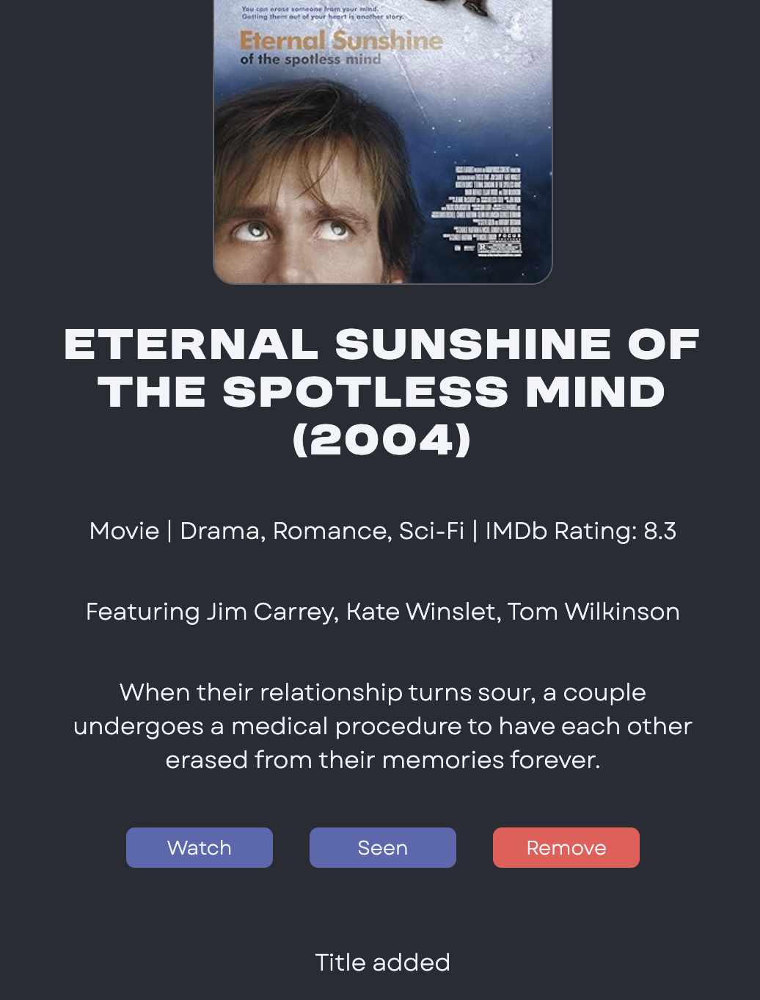
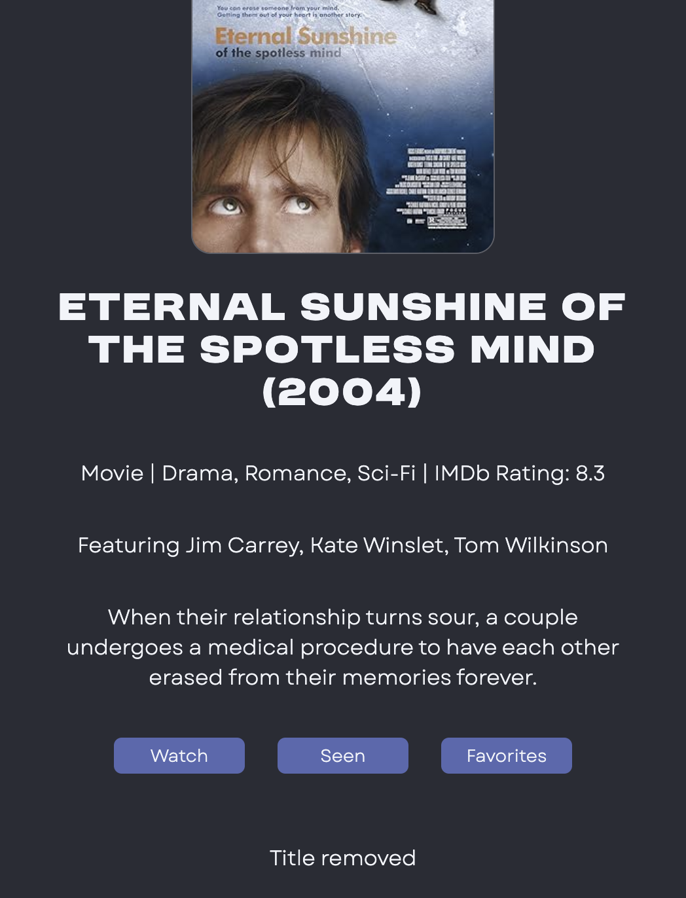
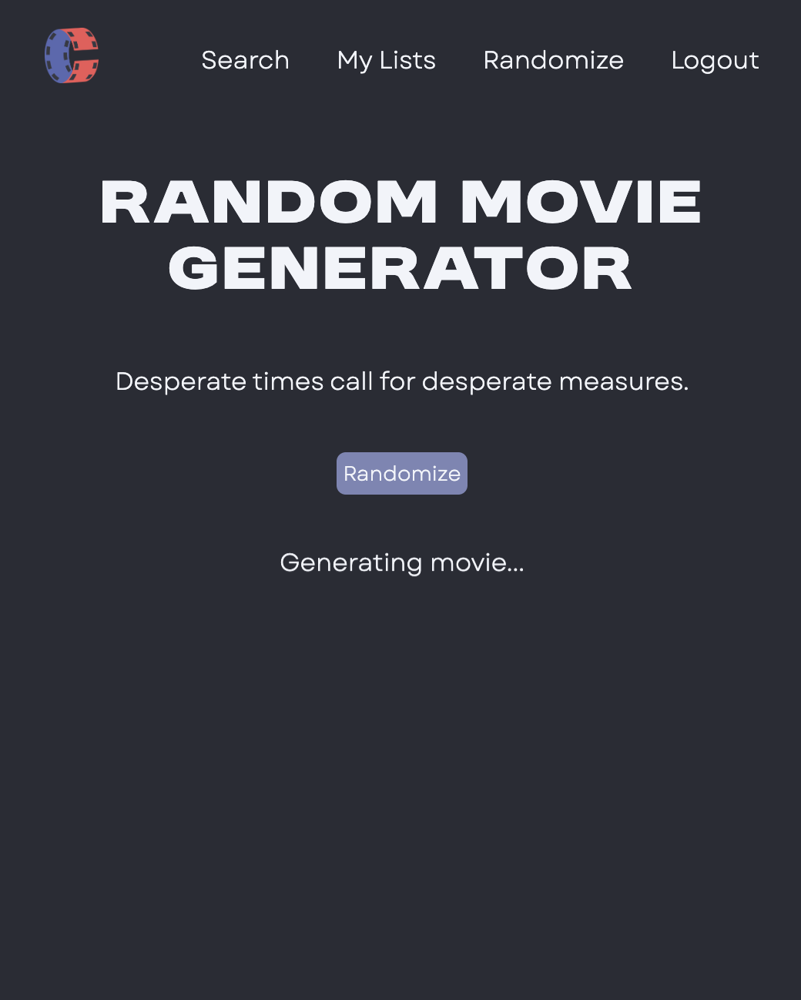

# Cinememo 

Cinememo is a full-stack, NextJS, MongoDB movie and TV show tracking app using the [OMDb API](https://www.omdbapi.com/).

I created this app for fellow film-lovers who are always searching for the next thing to watch and enjoy keeping track of what they have seen. Thanks to the OMDb API, Cinememo allows users to track not just movies but also TV shows, too.

Click [here](https://cinememo.vercel.app/) to view the live site and create an account.

## App Overview

With Cinememo, users can:

- Create an account with a username and password
- Search for movies and TV shows by title keyword
- View the first 10 poster images of the related search results 
- Click on any result to view more information, including: 
    - Title
    - Year of release
    - Poster image
    - Type (movie, show, documentary, etc.)
    - Genre
    - IMDb rating
    - Cast members
    - Plot summary
- Add any title to their watch list, seen list, or favorites list
- Remove any title from these lists
- Generate a random movie pick

## Understanding UX

Throughout the entire app creation process, I made sure to have the mindset of a user despite being the developer. I wanted this app to be as user-friendly as possible. As such, I paid attention to the little things while coding Cinememo by including features like:
- Loading message while search results or movie details are gathered
- Loading message while adding a title to or removing one from a user list
- Message indicating the title was successfully added or removed
- Different button colors based on the add and remove functions
- Animated loading message while the random movie generator is pulling movie information
- Animated images and buttons responsive to hovering

 

   

Designs by Julia Bauer.

 

This is a [Next.js](https://nextjs.org/) project bootstrapped with [`create-next-app`](https://github.com/vercel/next.js/tree/canary/packages/create-next-app).

